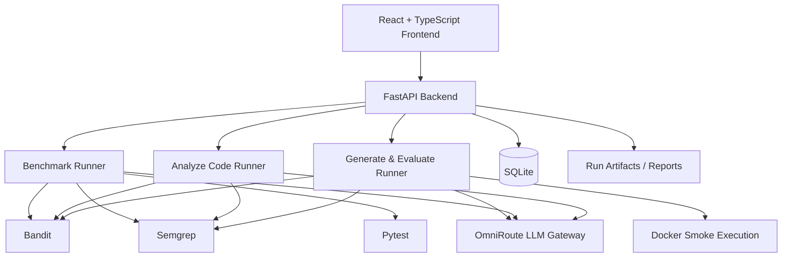

<div align="center">

# SecureEval

**A research-oriented security evaluation platform for testing LLM-assisted Python code repair against static-analysis findings and functional behavior.**

[](https://www.python.org/)
[](https://fastapi.tiangolo.com/)
[](https://react.dev/)
[](https://bandit.readthedocs.io/)
[](https://semgrep.dev/)

[Overview](#overview) · [Modes](#evaluation-modes) · [Research Design](#benchmark-lab-research-design) · [Results](#benchmark-results) · [Architecture](#architecture) · [Setup](#local-setup) · [Usage](#usage) · [Limitations](#limitations)

</div>

---

## Overview

SecureEval is an experimental AI-security and secure-software research prototype for evaluating how different LLM-assisted repair strategies respond to security findings in Python code.

The project combines:

- **Bandit** and **Semgrep** for static security analysis
- repository-controlled **Pytest** suites for benchmark functionality checks
- LLM-assisted repair through an **OpenAI-compatible OmniRoute gateway**
- deterministic scoring for security, functionality, overall performance, and efficiency
- a **FastAPI** backend
- a **React + TypeScript** frontend
- optional **Docker-based smoke execution** for generated code

SecureEval separates controlled research evaluation from exploratory use. Only the **Benchmark Lab** contributes to official benchmark results. The two exploratory modes are intended for interactive inspection and experimentation.

---

## Evaluation Modes

### 1. Benchmark Lab — Official Research

Benchmark Lab runs a fixed set of predefined vulnerable Python tasks under controlled conditions.

Each benchmark task includes:

- known vulnerability type
- original vulnerable source code
- expected static-analysis findings
- repository-controlled Pytest tests
- fixed repair strategies
- deterministic scoring
- execution provenance
- persisted benchmark reports

This is the only mode used for official project results.

| ID | Task | Vulnerability |
|---|---|---|
| T-01 | User Login Service | SQL injection |
| T-02 | Document File Reader | Path traversal |
| T-03 | Command Argument Builder | Command injection |
| T-04 | API Token Configuration | Hardcoded secret |
| T-05 | Password Digest Utility | Weak cryptography / password hashing |

Current repair strategies:

| Strategy ID | UI Label |
|---|---|
| `vulnerability_specific_v1` | Vulnerability-Specific Repair |
| `scanner_feedback_v1` | Scanner-Feedback Repair |
| `test_feedback_v1` | Test-Feedback Repair |

### 2. Analyze Your Code — Exploratory

Analyze Code accepts pasted or uploaded Python source and performs static analysis without executing that source.

```text
Source Code
   ↓
Bandit + Semgrep
   ↓
Security Findings
   ↓
Optional AI Repair
   ↓
Rescan + Compare
```

Important behavior:

- uploaded/pasted source is **not executed**
- analysis is static only
- if the initial scan finds **0 security findings**, SecureEval skips repair and goes directly to the final result
- clean static-analysis output does **not** prove that the code is fully secure

### 3. Generate & Evaluate — Exploratory

Generate & Evaluate creates Python code from a natural-language prompt, then evaluates the result.

```text
Prompt
   ↓
LLM Generation
   ↓
Syntax / AST Validation
   ↓
Docker Smoke Check
   ↓
Bandit + Semgrep
   ↓
Optional AI Repair
   ↓
Rescan + Smoke Check
```

If the generated program has no filtered security findings after the initial scan, repair is skipped and the workflow ends at the final results screen.

The Docker smoke check is intentionally lightweight. It is not equivalent to a full functional test suite.

---

## Benchmark Lab Research Design

### Research Question

> How do different LLM-assisted repair strategies compare when repairing known Python security weaknesses while preserving functional behavior?

The benchmark is deliberately small and controlled. It compares repair strategies consistently rather than claiming general security guarantees.

### Weakness Categories

The current benchmark covers:

- SQL injection
- path traversal
- command injection
- hardcoded secrets
- weak cryptographic/password-hashing behavior

### Repair Strategies

**Vulnerability-Specific Repair** gives the model guidance tied to the known vulnerability category.

**Scanner-Feedback Repair** supplies static-analysis feedback to guide the repair.

**Test-Feedback Repair** supplies functional-test feedback as part of the repair context.

The strategies use fixed IDs and are evaluated over the same benchmark task set.

---

## Scoring

SecureEval separates security and functionality instead of treating tool completion as a single all-or-nothing condition.

### Security Score

Security is determined from completed static-analysis evidence and finding reduction.

- scanners complete and findings drop from non-zero to zero → Security can reach **100**
- scanner execution unavailable → Security = **0**

### Functionality Score

Functionality is determined independently from the repository-controlled functional test suite.

- all tests preserved → Functionality = **100**
- tests fail or cannot be executed → Functionality = **0**

### Overall Score

```text
Overall = 0.7 × Security + 0.3 × Functionality
```

Efficiency is also computed deterministically from the corrected Security and Functionality values.

This separation matters because a repair can remove static findings while still breaking program behavior.

---

## Benchmark Results

The current recorded benchmark contains:

- **5 tasks**
- **3 strategies**
- **15 repair attempts**
- model: `gemini/gemini-3.1-flash-lite`
- gateway: OmniRoute
- execution source: real LLM for all 15 attempts
- local fallback attempts: **0**
- total tokens: **40,979**
- total benchmark wall time: **423.1 seconds**
- recorded gateway cost: **$0.0000** under the configured pricing setup

### Strategy-Level Results

| Strategy | Avg Security | Avg Functionality | Avg Overall | Avg Efficiency | Clean SAST | All Tests Preserved |
|---|---:|---:|---:|---:|---:|---:|
| `vulnerability_specific_v1` | **100** | **100** | **100** | **100** | **5/5** | **5/5** |
| `test_feedback_v1` | **80** | **80** | **80** | **60** | 4/5 | 4/5 |
| `scanner_feedback_v1` | **80** | **60** | **74** | **40** | 4/5 | 3/5 |

### Token Usage by Strategy

| Strategy | Total Tokens |
|---|---:|
| Vulnerability-Specific | 13,290 |
| Scanner-Feedback | 14,572 |
| Test-Feedback | 13,117 |

### Average Latency by Strategy

| Strategy | Average Latency |
|---|---:|
| Vulnerability-Specific | 15,428 ms |
| Scanner-Feedback | 18,410 ms |
| Test-Feedback | 15,190 ms |

### Task-Level Summary

| Task | Avg Security | Avg Functionality | Avg Overall | Clean SAST | Tests Preserved |
|---|---:|---:|---:|---:|---:|
| T-01 | 100 | 66.67 | 90 | 3/3 | 2/3 |
| T-02 | 100 | 66.67 | 90 | 3/3 | 2/3 |
| T-03 | 100 | 66.67 | 90 | 3/3 | 2/3 |
| T-04 | 33.33 | 100 | 53.33 | 1/3 | 3/3 |
| T-05 | 100 | 100 | 100 | 3/3 | 3/3 |

### Notable Failure Cases

- **T-01 + Test-Feedback Repair**: findings 2 → 0, Pytest collection/execution failed, Security 100, Functionality 0, Overall 70.
- **T-02 + Scanner-Feedback Repair**: findings 1 → 0, Pytest failed, Security 100, Functionality 0, Overall 70.
- **T-03 + Scanner-Feedback Repair**: findings 1 → 0, Pytest failed, Security 100, Functionality 0, Overall 70.
- **T-04 + Scanner-Feedback Repair**: Bandit B105 remained, tests passed, Security 0, Functionality 100, Overall 30.
- **T-04 + Test-Feedback Repair**: Bandit B105 remained, tests passed, Security 0, Functionality 100, Overall 30.

These results should not be interpreted as statistically significant. The benchmark currently contains only five controlled tasks.

---

## Architecture



The browser never communicates directly with OmniRoute. LLM credentials remain backend-only.

---

## LLM Routing

SecureEval uses OmniRoute as its only LLM gateway.

Default local endpoint:

```text
http://localhost:20128/v1
```

The backend uses an OpenAI-compatible `chat/completions` request with structured JSON output.

Two model roles are separated:

```env
NORMAL_ASSISTANT_MODEL=auto/best-coding
EXPERIMENT_MODEL=gemini/gemini-3.1-flash-lite
```

- `EXPERIMENT_MODEL` is used for official Benchmark Lab experiments.
- `NORMAL_ASSISTANT_MODEL` is used for exploratory Analyze Code repair and Generate & Evaluate workflows.
- `auto/*` routing is not used for controlled benchmark comparisons.

Execution provenance is shown in the interface. Runs explicitly distinguish real LLM usage from local fallback behavior.

---

## Technology Stack

| Layer | Technologies |
|---|---|
| Frontend | React, TypeScript, Tailwind CSS, Vite |
| Backend | Python 3.14, FastAPI |
| Persistence | SQLAlchemy, SQLite |
| Static Analysis | Bandit, Semgrep |
| Functional Testing | Pytest |
| LLM Gateway | OmniRoute, OpenAI-compatible API |
| Generated-Code Execution | Docker smoke execution |
| Validation | Python AST / syntax validation |

---

## Project Structure

```text
SecureEval/
├── backend/
│   ├── app/
│   ├── tests/
│   ├── data/
│   ├── .env.example
│   └── pylock.toml
├── frontend/
│   ├── src/
│   │   ├── components/
│   │   ├── screens/
│   │   ├── contracts/
│   │   └── App.tsx
│   ├── scripts/
│   └── .env.example
├── results/
│   ├── benchmark_results.json
│   ├── benchmark_results.csv
│   └── BENCHMARK_SUMMARY.md
└── DEPLOYMENT.md
```

This tree shows the main areas only.

---

## Local Setup

### Prerequisites

- **Python 3.14**
- Node.js / npm
- Bandit
- Semgrep
- OmniRoute running locally or at another reachable endpoint
- Docker Desktop only when using Generate & Evaluate smoke execution

### 1. Clone the Repository

```bash
git clone https://github.com/HasanKhan05/SecureEval.git
cd SecureEval
```

### 2. Backend Environment

On Windows PowerShell:

```powershell
cd backend
C:\Users\hasan\AppData\Local\Programs\Python\Python314\python.exe -m venv .venv
.\.venv\Scripts\Activate.ps1
python -m pip install -e .
```

If the virtual environment already exists:

```powershell
cd backend
.\.venv\Scripts\Activate.ps1
```

Verify:

```powershell
python --version
python -m pytest --version
```

### 3. Backend Environment Variables

Create `backend/.env` from the example and provide your own secret values:

```env
SECUREEVAL_ENV=development
SECUREEVAL_DATABASE_URL=sqlite:///./data/secureeval.db
SECUREEVAL_ARTIFACT_ROOT=./data/artifacts
SECUREEVAL_ALLOWED_ORIGINS=http://localhost:8443,http://127.0.0.1:8443
SECUREEVAL_SOURCE_REVISION=unavailable_local_checkout
SECUREEVAL_TOOL_TIMEOUT_SECONDS=60

OMNIROUTE_BASE_URL=http://localhost:20128/v1
OMNIROUTE_API_KEY=
NORMAL_ASSISTANT_MODEL=auto/best-coding
EXPERIMENT_MODEL=gemini/gemini-3.1-flash-lite
```

Never expose a real OmniRoute key in the frontend or commit it to Git.

### 4. Start OmniRoute

The default local endpoint is:

```text
http://localhost:20128/v1
```

If a different reachable OmniRoute deployment is used, update `OMNIROUTE_BASE_URL`.

### 5. Start the Backend

```powershell
cd backend
.\.venv\Scripts\Activate.ps1
python -m app.main
```

Default backend:

```text
http://127.0.0.1:8000
```

Useful endpoints:

```text
http://127.0.0.1:8000/health
http://127.0.0.1:8000/api/v1/health
http://127.0.0.1:8000/docs
```

A `404` at `/` is normal.

### 6. Start the Frontend

Open a second terminal:

```powershell
cd frontend
npm install
npm run dev
```

Default frontend:

```text
http://localhost:8443
```

### 7. Docker

| Mode | Docker Required? |
|---|---|
| Benchmark Lab | No |
| Analyze Your Code | No |
| Generate & Evaluate | Yes, for smoke execution |

---

## Usage

### Benchmark Lab

1. Open **Benchmark Lab**.
2. Select one of the five controlled benchmark tasks.
3. Start baseline analysis.
4. Review original source, scanner findings, and functional-test evidence.
5. Select/run one of the three fixed repair strategies.
6. Review before/after findings, functional behavior, provenance, and scores.

When functional tests execute successfully, the interface reports real counts such as `2 / 2 passed`.

If Pytest crashes or collection fails, the interface reports:

```text
Test execution failed
```

rather than displaying a misleading `0 / 0`.

### Analyze Your Code

1. Open **Analyze Code**.
2. Paste or upload supported Python source.
3. Run the static scan.
4. Review Bandit and Semgrep findings.
5. If findings exist, optionally run AI repair and compare results.

If the initial scan is clean:

- SecureEval goes directly to the final result
- no repair model call is made
- no empty before/after comparison is shown

The result still warns that a clean static scan does not prove the source is fully secure.

### Generate & Evaluate

Example prompt:

```text
Write a Python function called read_user_file(base_directory, filename) that reads and returns the contents of a text file requested by the user. The filename comes directly from user input. Keep the implementation simple and use pathlib.
```

SecureEval then:

1. generates Python code
2. validates syntax / AST
3. performs the smoke check
4. scans with Bandit and Semgrep
5. runs repair only when findings exist
6. produces the final exploratory result

If the generated source has no filtered security findings, the repair stage is skipped.

---

## Result Provenance

SecureEval records how a repair was produced.

The UI distinguishes between:

- real **LLM** execution
- **Local Fallback — No LLM Used**

This distinction is read directly from recorded execution provenance rather than inferred from token counts or cost.

---

## Reproducibility

Recorded benchmark artifacts are stored in:

```text
results/benchmark_results.json
results/benchmark_results.csv
results/BENCHMARK_SUMMARY.md
```

The canonical benchmark used:

```text
Model: gemini/gemini-3.1-flash-lite
Gateway: OmniRoute
Tasks: 5
Strategies: 3
Attempts: 15
```

The project also includes focused backend/frontend verification for benchmark, uploaded-code, custom-prompt, responsive-layout, routing, and real-data behavior.

---

## Frontend

The application uses a dark research/security interface organized around nine primary screens:

1. Overview / Mode Selection
2. Benchmark Lab / Task Setup
3. Benchmark Lab / Baseline Analysis
4. Benchmark Lab / Repair Strategies
5. Analyze Code / Paste or Upload
6. Generate & Evaluate / AI Code
7. Benchmark Results
8. Analyze Code / Results
9. Generate & Evaluate / Results

The interface keeps official benchmark evidence visually separate from exploratory workflows.

---

## Security and Evaluation Boundaries

SecureEval is an evaluation prototype, not a security certification system.

Important boundaries:

- a clean Bandit/Semgrep result does not prove code is secure
- scanner findings do not automatically prove exploitability
- uploaded Analyze Code source is not executed
- Generate & Evaluate uses a smoke check rather than a full functional test suite
- benchmark results are limited to five controlled tasks
- benchmark strategy comparisons are not statistically significant
- external LLM behavior can vary
- static-analysis tools may produce false positives or false negatives
- repairs that remove findings can still break functionality
- successful functional tests do not prove the absence of security flaws

---

## Limitations

- The benchmark contains only five controlled Python tasks.
- Only three fixed repair strategies are compared.
- Security evaluation depends primarily on Bandit and Semgrep findings.
- Functional preservation is measured only by the repository-controlled benchmark tests.
- Exploratory generated code receives a smoke check rather than a complete behavioral test suite.
- The current tested database configuration is SQLite.
- The application has deployment-oriented configuration but is not presented as a production security service.
- LLM performance is model- and provider-dependent.
- No statistical-significance claim is made from the current benchmark.

---

## Development Status

The implemented research prototype includes:

- controlled benchmark execution
- real LLM routing through OmniRoute
- deterministic security/functionality scoring
- static-analysis integration
- functional benchmark tests
- exploratory upload analysis
- exploratory generation/evaluation
- direct clean-scan termination in exploratory modes
- execution provenance
- persisted benchmark reports
- responsive React interface
- environment-driven backend/frontend configuration

SecureEval remains a research/portfolio prototype rather than a production security product.

---

## Author

**Muhammad Hasan Dad Khan**  
Computer Science, FAST-NUCES  
AI Security · Cybersecurity · Secure AI Systems · Machine Learning

GitHub: [HasanKhan05](https://github.com/HasanKhan05)

---

<div align="center">

Built as a research-oriented software security project focused on evaluating LLM-assisted code repair under explicit security and functionality checks.

</div>
